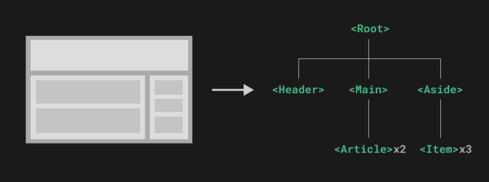
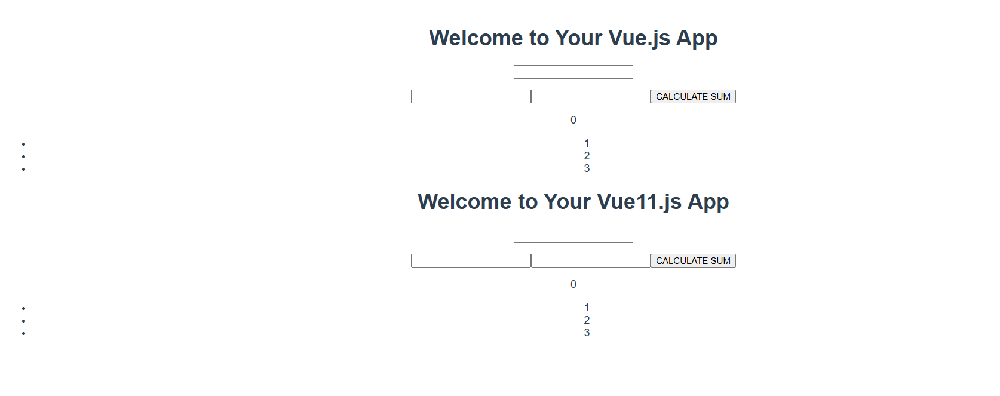

### **Cách bước để bắt đầu sử dụng được Vue trên laragon**

### + vào Terminal gõ lệnh ”npm install -g @vue/cli” ( Lệnh này sẽ giúp tại các thứ cần thiết để chạy vue).

### + để tạo dự án mới ta chạy lệnh “ vue create my-project”

+ sau đó “ cd my-project” để truy cập vào project rồi chạy lệnh “npm run serve”

* Kết quả:

Trong phpstoms ta sẽ được 1 thư mục có cấu trúc như sau:

+ Tệp chính sẽ là main.js

+ App.vue sẽ là thư mục gốc

+ Trong thư mục components/: chứa các thành phần giao diện được tái sử dụng

***Kiến thức cần biết***

### **Reactive Data Binding**

Tự động đồng bộ dữ liệu giữa giao diện và logic thông qua các chỉ thị (directives) như v-model, v-bind.

V-model: giúp bạn kết nối một input field với một dữ liệu trong component

	 <(input hoặc textarea) v-model="message" placeholder="Type something">

     
Message: {{ message }}

Nó còn tác dụng với các textarea, select

	 <select v-model="selectedOption">
    		<option disabled value="">Please select one</option>
    		<option>Option 1</option>
    		<option>Option 2</option>
    		<option>Option 3</option>
  	</select>
    
Selected: {{ selectedOption }}

Các modifier của v-model:

+ lazy: với cái này thì sẽ lưu giá trị khi người dùng tap ra khỏi input

+ number: tự động chuyển đổi thành số

+ trim: giúp loại bỏ khoảng trắng ở đầu và cuối

Ta có làm với v-model với components nhưng ta cần phải xác định và phát hiện ra sự kiện input

    <template>
         <input :value="value" @input="$emit('input', $event.target.value)" />
    </template>
    

Trong trường hợp này là sẽ giúp ta lưu ra giá trị vừa nhập vào value

Lifecycle Hooks:(Phần này khá lằng nhăng lên đọc kĩ hơn)

Cũng như cái tên gần như là 1 vòng đời với nó ta có thể thực hiện các tác vụ như khởi tạo, hủy bỏ , cập nhật

+ beforeCreate(): là thời điểm bắt đầu tiến trình và khi dùng ta không thể nào truy cập vào được data, computed,
  watchers

      beforeCreate() {
         console.log('beforeCreate');
      }

+ created(): như cái tên là được tạo ra và nó được gọi ngay khi instance được khởi tạo và giờ ta có thể truy cập vào
  data, computed, watchers

      created() {
         console.log('created');
         console.log(this.message);
      }

+beforeMount(): nó sẽ được sử dụng ngay trước khi Vue instance được mount vào DOM , sau khi render hàm được gọi lần đầu
tiên được dùng trong khi DOM chưa được tạo và bạn không thể truy cập vào DOM elements

      beforeMount() {
        console.log('beforeMount');
      }

+ mount(): trái ngược với beforeMount nó được sử dụng sau khi đã được mount vào DOM dùng khi lúc bạn có thể truy cập
  vào DOM và thực hiện các tác vụ liên quan đến DOM như cập nhật hoặc gọi API.

      mounted() {
        console.log('mounted');
      }

+ beforeUpdate(): dùng trước khi có sự thay đổi với data hoặc props

      beforeUpdate() {
        console.log('beforeUpdate');
      }

+ update(): dùng ngay sau khi Vue component được re-render và DOM được cập nhật.

      updated() {
        console.log('updated');
      }

+ beforeUnmount(): ngay trước khi Vue instance bị hủy bỏ (unmounted). Đây là thời điểm trước khi Vue bắt đầu làm sạch
  các resources.

      beforeUnmount() {
        console.log('beforeUnmount');
      }

+ Unmount(): được gọi ngay sau khi Vue instance đã bị hủy bỏ và tất cả các listener sự kiện hoặc resources liên quan đã
  được dọn dẹp. Dùng khi bạn có thể thực hiện các tác vụ sau khi Vue instance bị hủy, như giải phóng bộ nhớ hoặc dọn dẹp
  tài nguyên

      unmounted() {
        console.log('unmounted');
      }

### **WATCHER(!!!!)**

Watchers là một tính năng trong Vue.js cho phép bạn theo dõi sự thay đổi của dữ liệu (data) và thực hiện các hành động (
ví dụ như gọi API, tính toán lại giá trị, hoặc thay đổi DOM) khi dữ liệu thay đổi.

Cách hoạt động: Khi một thuộc tính trong data thay đổi, watcher sẽ "lắng nghe" sự thay đổi đó và gọi một hàm xử lý mà
bạn đã chỉ định.

+ Format của watcher:

Sử dụng watch trong Vue instance: Bạn có thể khai báo các watcher trong object watch trong Vue instance.

Cơ chế hoạt động: Khi dữ liệu mà bạn "watch" thay đổi, hàm callback sẽ được gọi. Bạn có thể sử dụng watcher để thực hiện
các tác vụ bất đồng bộ như gọi API hoặc tính toán lại các giá trị phụ thuộc vào dữ liệu đó.

* How to use:

    + Basic: tạo 1 watcher để theo dõi 1 thuộc tính cụ thể của data và thực hiện hành động khi value change

          <template>
              

                    <input v-model="message" />
                    
{{ message }}

              

          </template>
          

Với trường hợp này giá trị message sẽ thay đổi ( do người dùng nhập vào ô input), thì lúc này vue sẽ gọi hàm watch ra
chứa 2 tham số mới của oldValue, newValue.

+ Watcher cho nhiều thuộc tính:

        

            <input v-model="message" />
            <input v-model="count" />
            
Message: {{ message }}

            
Count: {{ count }}

        

        data() {
            return {
                message: '',
                count: 0
            };
        },

        watch: {
            message(newValue) {
            console.log('Message changed to:', newValue);
            },
            count(newValue) {
                console.log('Count changed to:', newValue);
            }
       }

Trường hợp là khi ta nhập giá trị mới vào cả message và count đều có watcher riêng biệt, và mỗi khi một trong hai giá
trị thay đổi.

+ Watcher với dữ liệu phức tạp:

Trong trường hợp khi bạn muốn theo dõi như 1 mảng và đối tượng, ta có thể dùng deep để theo dõi sâu vào từng chi tiết
của từng phần tử trong mảng và đối tượng.

      <template>
          

              <input v-model="user.name" />
              
User Name: {{ user.name }}

          

    </template>
    

Khi ta thay đổi bất cứ thuộc tính nào của user thì nó sẽ tự gọi watcher về. Với deep: true, Vue sẽ theo dõi mọi thay đổi
trong user, không chỉ thay đổi trực tiếp của chính thuộc tính đó

+watchEffect: cho phép chúng ta theo dõi các phụ thuộc phản ứng của lệnh gọi lại một cách tự động, kết hợp theo dõi phụ
thuộc và tác dụng phụ thành một giai đoạn. Nó tự động theo dõi mọi thuộc tính phản ứng được truy cập trong quá trình
thực thi đồng bộ của nó.

Ví dụ:

    import { reactive, watchEffect } from 'vue';
    const state = reactive({ count: 0, name: 'Vue' });
    watchEffect(() => {
       console.log(state.count, state.name);
    });
    state.count++;
    state.name = 'React';

Trong trường hợp này thì nó sẽ tự theo dõi các giá trị của count và name sẽ tự động chạy lại và in ra các giá trị mới
của chúng.

+Stop Watcher: Do watcher được khai báo đồng bộ bên trong lên nếu trong trường hợp không đồng bộ thì ta phải dừng thu
công để không bị rò rỉ bộ nhớ

    

Và ta có 1 hàm trả về như sau:

    const unwatch = watchEffect(() => {})
    unwatch()

**Directives (Chỉ thị)**

**v-if**: Hiển thị điều kiện.

	Ví dụ: kiểm tra xem mật khẩu trùng nhau hay không hoặc là làm chức năng hidden

**v-for**: Lặp qua danh sách cũng gần giống với foreach
Ví dụ

    :v-for="(item, index) in foods" :key="index"
    {{ index + 1 }}. {{item.name}} - Price:{{item.price}} VND // goi ra
    data() {
      return {
        food: [
          { name: "fish", price: 100000 },
          { name: "meat", price: 200000 },
          { name: "sushi", price: 300000 },
      ],
    };

**v-bind**: Liên kết thuộc tính

     <!-- cú pháp viết tắt --> <a :href="url">

**v-on**: Lắng nghe sự kiện cũng được viết gọn là @click

     <!-- cú pháp ngắn gọn -->@click="doSomething">

**v-show**: chỉ thị v-show hoạt động tương tự như v-if, nhưng thay vì loại bỏ phần tử khỏi DOM, nó chỉ thay đổi thuộc
tính
CSS display.

**v-else-if**: xác định điều kiện khác nếu v-if trước đó là false

(v-if:điều kiện thay đổi hiếm còn v-for là cho thường xuyên)

**Event Handling**
Dễ dàng xử lý sự kiện với cú pháp như @click="methodName".
**Animation**
Hỗ trợ tích hợp các hiệu ứng chuyển động, dễ dàng sử dụng giống như là làm với css bình thường.
Ví dụ:

    
{{ title }} -- {{ name }} -- {{ age }}
 

Ta có thể rut gọn bằng cách cho nó vào 1 actor như này

    actor() {
      return ${this.title} ${this.name} ${this.age};
    }

Xong gọi ra {{actor}}

Trường hợp khác có thể gọi ra như sau :

    const firstName = ref('John');
       const lastName = ref('Doe');
       const fullName = computed(() => ${firstName.value} ${lastName.value});
       return { firstName, lastName, fullName };

    }

Gọi ra fullname

Ta cũng thể dùng cả get set

    data() {
       return {
         firstName: 'John',
         lastName: 'Doe'
     };

    },

    computed: {
       fullName: {
         get() {
            return ${this.firstName} ${this.lastName};
       },
      set(newValue) {

           const parts = newValue.split(' ');
           this.firstName = parts[0] || '';
           this.lastName = parts[1] || '';

       }

      }

    }

Dùng trong trường hợp khi cần nhập dữ liệu từ input

Hoặc trong trường hợp tính số tiền hóa đơn này

    data() {

        return {
           cartItems: [
             { name: 'Apple', price: 10, quantity: 2 },
             { name: 'Banana', price: 5, quantity: 3 }
        ]

       };

    },

    computed: {

       totalPrice() {
           return this.cartItems.reduce((total, item) => {
           return total + item.price * item.quantity;
        }, 0);

    }

Rồi ta lại gọi hàm totaliprice ra

**Class and Style Bindings**

Liên kết thuộc tính class

Giúp đặt tên cho class để class không còn hiện là data123

Liên kết với 1 đối tượng

Trong trường hợp như này:

    return {
       Food: true,
       Water: false
    };

    
Hello World

Nếu thỏa mãn điều kiện trên thì sẽ được kết quả là

    
Hello World

Liên kết với 1 mảng

     return {
          Eat: 'food',
          Drink: 'water'

     };

    :class=”[Eat,drink]” == class=”food,water”

Ta cũng có thể kết hợp cả chuỗi + mảng + đối tượng cùng với nhau

**Style Bindings**

Basic

    :style="styleObject"

Tương tự như với class ta cũng sẽ liên kết được với, mảng , đối tượng

Ví dụ

Đối tượng:

    Apple: {
      color: 'red',
      fontSize: '14px'
    }

    :style=”Apple”

Mảng

    Color: {
      color: 'blue'
    },

    Size: {
      fontSize: '16px'
    }
    :style=”[color,size]”

Ví dụ

Làm biến động

    Color:’red’,
    Size:14,
    
Dynamic Style

Hiển nhiên là ta cũng có thể kết hợp cả class và style

**List Rendering**

Sẽ được kết hợp với v-for:

Cảm giác dùng sẽ hơi giống với foreach của laravel

Cũng sẽ lặp từng phần tử

     

       {{ item }}
    

Khác với foreach là phải :key đây là thuộc tính bắt buộc giúp Vue tối ưu hóa DOM

Ví dụ;

    <template>
      <ul>
        <li v-for="(item,index) in fruits" :key="index">
        {{ index + 1 }}. {{ item }}
        </li>
     </ul>
    </template>
    

Khác với ví dụ trên là nếu qua object thì kết quả sẽ ra là

    0: name = John

    1: age = 30

    2: country = USA

Nhờ có nó ta có thể làm thêm chức năng như them và xóa và với các components. Ta còn có thể kết hợp các điều kiện với
nhau

Even Handling:

Bao gồm các click, button, submit

Trường hợp của click:

+ Khi ta thêm @vào là sẽ thành viết tắt cho v-on

+ Phương thức xử lý sự kiện ta có thể định nghĩa cho nó như trong trường hợp này ta có thê định nghĩa nó để hiện thông
  báo khi ta nhấn vào:

      <template>
       

          <button @click="showAlert">Click me</button>
       

      </template>
      

+ Truy tham số cho nó : Trường hợp này là nó sẽ hiện thông báo

      <template>
         

            <button @click="greet('Hello')">Click me</button>
        

      </template>
      

+ Ngừng sự kiện với event.stopPropagation

      

          <button @click.stop="buttonClick">Click me</button>
      

Nó sẽ chỉ hiện thông báo của butotnclick thôi còn parent thì không

+ ngừng hành vi với event.preventDefaut()

      <form @submit.prevent="submitForm">
          <button type="submit">Submit</button>
      </form>

Trong trường hợp này nó sẽ chặn làm cho form không gửi được

Sử dụng .once để lắng nghe sự kiện chỉ một lần

     <button @click.once="buttonClick">Click me</button>

Làm chỉ thấy được việc chỉ có 1 lần thôi

+ Sử dụng .key để xử lý các phím cụ thể

      <input @keyup.enter="submitForm" placeholder="Press Enter" />

Mặc định gắn thêm nút cho sự kiện này như trong trường hợp này enter

+ Kết hợp nhiều sự kiện với .native

Vue.js cung cấp cách lắng nghe sự kiện gốc (native event) trên các component bằng cách sử dụng .native.

     <my-component @click.native="handleClick"></my-component>

**Template Refs**

+ cách để truy cập trực tiếp vào các phần tử DOM. Cách thường được dùng giống như với :key.

      <input ref="input">
+ Dùng ref ở trong v-for

      <li v-for="(item, index) in list" :key="index" ref="items">
        {{ item }}
      </li>

**Components Basics**
Mô hình của Vue thường được xây dựng như sau:

+ Defining a Component: nơi bạn có thể khai báo các thuộc tính như data, methods, props

        export default {
              props: {
                  msg: String
              },
              data() {};
              method() {};
              computed() {};
+ Passing Props: cách để truyền dữ liệu từ component cha sang component con. Bạn có thể định nghĩa props trong component
  con và truyền giá trị từ component cha bằng cách sử dụng thuộc tính trong thẻ component con.
  ở file App.vue là component cha ta khai báo như sau:

        import TitleLogin from './components/WeekTwo.vue'
        export default {
              name: 'App',
              components: {
                  TitleLogin
              },
        }
        
        <template>
             <TitleLogin msg="Welcome to Your Vue.js App"/>
        </template>

trong đoạn này đã import cho file App.vue sử dụng phần tử của component con của file WeekTwo.vue là 'TitleLogin'

        name: 'TitleLogin',
        props: {
             msg: String
        },
        
        <h2>{{ msg }}</h2>

khi khởi chạy ta sẽ chạy ra nội dung có trong component ở App.vue ta sẽ được kết quả khi chạy như sau: 
        
nếu ta tạo thêm 1 component giống vậy nữa thì ta sẽ được kết là phần component TitleLogin sẽ được tạo ra thêm 1 lần nữa và toàn bộ nội dung component con trong WeekTwo sẽ được lặp lại 1 lần nữa.
        
ta có thể khai báo 1 hàm và dùng v-for để không cần phải tạo nhiều component như ví dụ trên:

      const posts = ref([
          { id: 1, title: 'My journey with Vue' },
          { id: 2, title: 'Blogging with Vue' },
          { id: 3, title: 'Why Vue is so fun' } 
      ])
+ Listening to Events:quá trình phản hồi khi một sự kiện được kích hoạt từ một component con (child component) hoặc từ các sự kiện DOM gốc do trình duyệt tạo ra.
có thể gọi sự kiện đó ra bằng cách như sau: 
Ví dụ tạo ra sự kiện phóng to chữ:

      @enlarge-text="postFontSize += 0.1"
khai báo nó ở bên weektwo: 
      
      defineEmits(['enlarge-text'])
      <button @click="$emit('enlarge-text')">Big text</button>

khi click vào cỡ ở trong component BlogTitle sẽ phóng to ra

+ Content Distribution with Slots: việc dùng slot nhằm mục đích là để truyền đi nội dung như dưới đây ta tạo 1 component gọi là MessageReport
  
       <MessageReport>SomeThing bad happened</MessageReport>
và gõ thêm dòng này lệnh này vào file WeekTwo thì nó sẽ hiện ra nội dung ta đã ghi trong Component:
         
       <slot/>
nó sẽ hiện ra kết quả: 

+ Dynamic Components : cho phép bạn hiển thị các component khác nhau dựa trên dữ liệu hoặc điều kiện như trong ví dụ sau cho phép ta hiển thị các components khác nhau:

Khai báo các component:

      import HelloWorld from "@/components/HelloWorld.vue";
      import WeekOne from './components/WeekOne.vue'
      import WeekTwo from "@/components/WeekTwo.vue";  

Khi click vào các button sau sẽ chuyển sang componet khác( có thể dùng trong việc chuyênr tiếp các trang web cũng khá hợp lý)

    <button @click="pages = 'HelloWorld'">Home</button>
    <button @click="pages = 'WeekOne'">WeekOne</button>
    <button @click="pages = 'WeekTwo'">WeekTwo</button>
    <component :is="pages"></component>

Self Closing Tags: là các component như kiểu các ví dụ trên ta đã tạo được như là <BlogTitle/>

**Component Registration**
Có 2 cách để Component Registration là Global Registration và Local Registration. Tại sao phải nghĩ ra 2 cách như vậy để làm gì ?
Tại vì: 
+ Global Registration: Component có thể được sử dụng ở bất kỳ đâu trong ứng dụng, phù hợp cho những component dùng nhiều lần trong nhiều nơi.
        Ví dụ:
        
         import MessageReport from './components/WeekTwo.vue'

         app.component('MessageReport', MessageReport)

       
+ Local Registration: Component chỉ có sẵn trong phạm vi của component cha, giúp tránh làm ô nhiễm không gian tên toàn cục và giảm khả năng xung đột khi sử dụng các component tương tự.      
        ví dụ:

        import MessageReport from './components/WeekTwo.vue'
        components: {
              MessageReport
        },
***PROPS***
Là 1 phần trong vue giúp truyền các component từ cha đến con nhằm mục đích tái sử dụng lại và tùy chỉnh lại các components
- Props Declaration
ví dụ:

      const props = defineProps(['msg'])
      console.log(props.msg)
- Reactive Props Destructure:giúp theo dõi trạng thái dựa trên việc truy cập thuộc tính
        
      const { msg } = defineProps(['msg'])
      watchEffect(() => {
         console.log(msg) 
      })
- Static vs. Dynamic Props: các biến động thường bao gồm các phần như number,boolean,Array,Object
+ Number

      <BlogTitle :likes="42" />
+ Boolean

      <BlogTitle :is-published="false" />    
+ Array

      <BlogTitle :comment-ids="[1, 2, 3]" />
+ Object

      <BlogTitle :author="{ name: 'Bach', company: 'ABC' }" />

- Binding Multiple Properties Using an Object
ví dụ: 

      const post = 
           {id: 1, 
            title: 'My journey with Vue'
      }
khi gọi nó ra thì ta chỉ cần chạy câu lệnh sau:

      <BlogTitle v-bind="post" /> thay vì chạy phải lệnh sau <BlogTitle :id="post.id" :title="post.title" />
- Prop Validation: các thành phần trong đều có thể gọi ra được theo yêu cầu props của chúng ví dụ như: 

      defineProps({
         propA: Number,
         propB: [String, Number],
         propC: {
             type: String,
             required: true
         },
         propD: {
             type: [String, null],
             required: true
         },
         propE: {
             type: Number,
             default: 100
         },
         propF: {
             type: Object,
             default(rawProps) {
                 return { message: 'hello' }
              }
         }
      })
rồi gọi các hàm ấy ra:

     <MessageReport :propA="10"
                    :propB="'Hello'"
                    propC="Required String"
                    propD="This is propD"
                    :propE="200"
                    :propF="{ message: 'Hello' }">
     </MessageReport>
trong trường hợp nêú bị báo lỗi "Cannot read properties of null (reading 'emitsOptions')" thì lên kiểm tra lại lại phiên bản Vue đang sử dụng có thể là do chưa cập nhật lên bị lỗi
      
     npm update

***Component Events***

được sử dụng để giao tiếp từ child component đến parent component, hoặc giữa các component khác nhau thông qua một event.

- Emitting and Listening to Events:sử dụng phương thức tích hợp $emit Ví dụ:

      export default {
            methods: {
               sendMessage() {
                   this.$emit('custom-event', 'Hello from child!'); 
               }
            }
      };
      <button @click="sendMessage">Gửi tin nhắn</button>
- Event Arguments: các dữ liệu được truyền kèm khi sự kiện được phát ra từ child component
  ví dụ: 
component con:
         
          <button @click="$emit('increaseBy', 1)">
                  Increase by 1
          </button>
          
component cha:

          <IncrementButton @increaseBy="incrementCount" />
ví dụ này khi click vào sẽ tăng số lên 1 

- Events Validation: chúng ta lắng nghe sự kiện submit từ Child Component và xử lý dữ liệu sau khi nhận được sự kiện hợp lệ.

Ví dụ: 
bên component con

     const emit = defineEmits({
         click: null,
         submit: ({ email, password }) => {
            if (email && password) {
                return true;
            } else {
                console.warn('Invalid submit event payload!');
                return false;
            }
         }
     });

bên component cha tạo hàm để check xem có thỏa mãn ko

     handleSubmit(data) {
         this.userData = data;
         console.log('Form submitted with data:', data);
     }

và ta sẽ được kết quả hiện ra được tài khoản và mật khẩu đã nhập 

**Component v-model**
v-model cũng có thể dùng giữa các giá trị trong component con và cha

Use in Basics way:
+ component con
    
      <template>
           

             < input v-model="inputValue" />
           

      </template>
      
+ componet cha
 
      <template>
          

            <input v-model="inputValue" />
          

      </template>
      

- v-model arguments: v-model trên một thành phần cũng có thể chấp nhận một đối số như vậy ta có thể dùng như sau
ví dụ: 

      
      <template>
          <h1>{{ bookTitle }}</h1>
          <MyComponent v-model:title="bookTitle" />
      </template>
- Multiple v-model bindings

component cha: 

       const first = ref('John')
       const last = ref('Doe')

      <template>
           <h1>{{ first }} {{ last }}</h1>
           <UserName
                    v-model:first-name="first"
                    v-model:last-name="last"
            />
     </template>
component con:

     
     <template>
           <input type="text" v-model="firstName" />
           <input type="text" v-model="lastName" />
     </template>

- Handling v-model modifiers: Vue hỗ trợ một số modifiers giúp bạn thay đổi cách thức hoạt động của v-model. Các modifiers phổ biến nhất là lazy, number, và trim.
ví dụ:
component cha

       
      <template>
          This input capitalizes everything you enter:
          <MyComponent v-model.capitalize="myText" />
      </template>

componet con

      
      <template>
           <input type="text" v-model="model" />
      </template>
Đoạn mã trên sử dụng defineModel để xử lý giá trị nhập vào với các modifier, tạo ra một v-model linh hoạt có thể tùy chỉnh hành vi cập nhật giá trị (ví dụ như viết hoa chữ cái đầu tiên).

***Fallthrough Attributes***
những thuộc tính được truyền từ component cha vào component con mà không cần phải khai báo chúng trực tiếp trong props của component con.

Basics:

     <button class="large">Click Me</button>

Bên component cha gọi ra như sau:

    <BlogButton class="large" />

Ở đây, <BlogButton>không khai báo class là một prop được chấp nhận. Do đó, class được coi là một thuộc tính fallthrough và tự động được thêm vào <BlogButton>phần tử gốc

- class and style Merging: Nếu phần tử gốc của thành phần con đã có các thuộc tính class hoặc hiện có style, nó sẽ được hợp nhất với các giá trị class và style được thừa hưởng từ phần tử cha

      <button class="btn large">Click Me</button>
- v-on Listener Inheritance: dùng giống như với v-on bình thường 
      
       <MyButton @click="onClick" />
- Disabling Attribute Inheritance:
+ Nếu bạn không muốn một thành phần nào đó tự động kế thừa các thuộc tính, bạn có thể thiết lập inheritAttrs: false trong các tùy chọn của thành phần đó.
  
      
+ Hoặc ta cũng có thể truy cập trực tiếp vào bằng $attrs

      Fallthrough attributes: {{ $attrs }}
+ Để đảm bảo rằng tất cả các thuộc tính (như class, v-on listener) được áp dụng cho phần tử <button> bên trong và không bị thừa kế bởi phần tử 
 bên ngoài, bạn có thể sử dụng inheritAttrs: false kết hợp với v-bind="$attrs" trong Vue.

      

           <button class="btn" v-bind="$attrs">Click Me</button>
      

+ Accessing Fallthrough Attributes in JavaScript: để truy cập vào ta cần phải khai báo 
   
      
trong ngữ cảnh ta dùng setup:
     
      export default {
           setup(props, ctx) {
              console.log(ctx.attrs)
           }
      }

***Slots***
là một cách để truyền nội dung từ component cha vào component con
+ ta có thể khai báo mặc định như sau

      <slot></slot>
+ Slot(''):Dành cho các thành phần như kiểu header, main ,aside

      <slot name="header"></slot>
+ Slot có Scoped Slot cho phép truyền dữ liệu từ component con ra ngoài và xử lý trong component cha mà không cần phải trực tiếp khai báo props 

      <template>
         

            <slot :message="message"></slot>
         

      </template>

      

khi chạy nó sẽ hiện ra giá trị của message trong component con

***Provide / Inject***
cho phép truyền dữ liệu từ component cha xuống các component con mà không cần phải truyền qua props từng cấp 
Trong đó:
+ Provide: Được sử dụng trong component cha để cung cấp dữ liệu.
- khi có setup:

      
- xét export default:

      import { provide } from 'vue'

      export default {
          setup() {
             provide(/* key */ 'message', /* value */ 'hello!')
          }
      }

+ Inject: Được sử dụng trong component con để nhận dữ liệu từ component cha.
- khi có setup:
     
       
- xét export default:

      import { inject } from 'vue'

      export default {
           setup() {
              const message = inject('message')
              return { message }
            }
      }
Lưu ý:
+ Slot: Cho phép truyền nội dung vào component từ bên ngoài, đặc biệt hữu ích khi muốn tạo các layout linh hoạt và tái sử dụng. Component cha có thể "đóng gói" nội dung vào slot của component con.(Interface)
+ Provide/Inject: Dùng để chia sẻ dữ liệu giữa các component không có mối quan hệ trực tiếp (không phải cha con). provide được sử dụng trong component cha để cung cấp dữ liệu, còn inject trong component con để nhận dữ liệu đó.(data)

***Async Components***
cho phép tải các component một cách bất đồng bộ (lazy-loading), giúp giảm kích thước ban đầu của ứng dụng và tối ưu hiệu suất.
ví dụ

     loadComponent() {
        this.asyncComponent = defineAsyncComponent(() => import('./components/WeekTwo.vue'));
        this.isLoaded = true;
     },
     
     <button @click="loadComponent">Load Component</button>
     <component :is="asyncComponent" v-if="isLoaded"></component>
khi chạy sẽ load lại component của WeekTwo mà ko load lại toàn bộ trang

***Custom Directives***
đây là 1 trong các cách tạo ra 1 Custom Directives 

     const vHighlight = {
        beforeMount: (el) => {
         .style.backgroundColor = 'yellow';
        }
     }

    

       
This sentence is important!

    

ví dụ: tạo ra 1 hàm vHighlight giúp đổi màu background của thẻ p trên 

- Khi nào ta lên sử dụng Custom Directives: Chỉ nên sử dụng các chỉ thị tùy chỉnh khi chức năng mong muốn chỉ có thể đạt được thông qua thao tác DOM trực tiếp 

ví dụ này ta sẽ tạo 1 biến vFocus để dùng chức năng mong muốn là v-focus

    const vFocus = {
        mounted: (el) => el.focus()
    }
     <input v-focus />
- Directive Hooks: với mọi Custom Directives đều được cung cấp các several hook functions

      const myDirective = {
       created(el, binding, vnode) {
       },
       beforeMount(el, binding, vnode) {},
       mounted(el, binding, vnode) {},
       beforeUpdate(el, binding, vnode, prevVnode) {},
       updated(el, binding, vnode, prevVnode) {},
       beforeUnmount(el, binding, vnode) {},
       unmounted(el, binding, vnode) {}
      }
- Hook Arguments: được truyền các các đối số sau:
+ el: phần tử mà chỉ thị được liên kết tới. Có thể sử dụng để thao tác trực tiếp DOM.
+ binding: một đối tượng có chứa các thuộc tính sau.
+ value: Giá trị được truyền cho chỉ thị. Ví dụ trong v-my-directive="1 + 1", giá trị sẽ là 2.
+ oldValue: Giá trị trước đó, chỉ khả dụng trong beforeUpdatevà updated. Giá trị này khả dụng bất kể giá trị có thay đổi hay không.
+ arg: Đối số được truyền cho chỉ thị, nếu có. Ví dụ trong v-my-directive:foo, đối số sẽ là "foo".

ví dụ vs binding:

     

     {
       arg: 'foo',
       modifiers: { bar: true },
       value: /* value of `baz` */,
       oldValue: /* value of `baz` from previous update */
     }
trong đó: 
+ arg: Đây là đối số của chỉ thị, ví dụ như v-bind:foo thì arg sẽ là 'foo'. 
+ modifiers: Các sửa đổi, ví dụ v-on:click.prevent sẽ có { prevent: true }.
+ value: Giá trị được gắn với chỉ thị, ví dụ giá trị của v-model="baz" là giá trị của biến baz.
+ oldValue: Giá trị trước khi cập nhật, giúp so sánh sự thay đổi giữa lần gọi trước và sau.

các đối số chỉ thị tùy chỉnh có thể là động như sau:
 
    

**Plugin**
là mã độc lập thường thêm chức năng cấp ứng dụng vào Vue

Basics way to plugin:

      import { createApp } from 'vue'
      const app = createApp({})
      app.use(myPlugin, {
      
      })
Một plugin được định nghĩa là một đối tượng phơi bày một install()phương thức hoặc chỉ là một hàm hoạt động như chính hàm cài đặt

      const myPlugin = {
          install(app,option){
          }
      }
+ cách để viết 1 plugin như sau:

      export default {
        install: (app, options) => {
        }
      }
Đây là 1 ví dụ để tạo chức năng dịch. Giả sử ta có 

    <h1>{{ $translate('greetings.hello') }}</h1>
Giờ ta sẽ thực hiện đính kèm vào app.config.globalProperties plugin

      export default {
         install: (app, options) => {
          app.config.globalProperties.$translate = (key) => {
            return key.split('.').reduce((o, i) => {
             if (o) return o[i]
            }, options)
          }  
         }
      }
Hàm $translate sẽ lấy một chuỗi như greetings.hello, xem bên trong cấu hình do người dùng cung cấp và trả về giá trị đã dịch. Giờ nó phải được chuyển đến plugin trong quá trình cài đặt thông qua các tham số bổ sung tới app.use()

      import i18nPlugin from './plugins/i18n'
          app.use(i18nPlugin, {
              greetings: {
                 hello: 'Bonjour!'
              }
          })

+ Provide / Inject with Plugins: Plugin cho phép ta sử dụng inject để có thể cải thiện các hàm và thuộc tính của Plugin. Ví dụ, ta có thể cho phép ứng dụng có quyền truy cập vào options tham số để có thể sử dụng đối tượng dịch.

    
      export default {
            install: (app, options) => {
                app.provide('i18n', options)
            }
      }
Người dùng plugin giờ đây có thể đưa các tùy chọn plugin vào thành phần của họ bằng cách sử dụng i18n khóa

      

**Teleport**
Teleport trong Vue 3 là một tính năng cho phép bạn di chuyển nội dung của một thành phần sang một vị trí khác trong DOM, nằm ngoài cấu trúc DOM cha mẹ của nó. Sử dụng khi bạn cần hiển thị nội dung ở vị trí khác trong DOM mà không bị giới hạn bởi cấu trúc cha con của thành phần. Khi muốn đến 1 vị trí xác định thì ta sẽ thêm to vào

      <teleport to = "">

      </teleport>
Ví dụ:

      

        <button @click="showModal = true">Open Modal</button>
        <teleport to="body">
          

            

              
This is a modal!

              <button @click="showModal = false">Close</button>
            

          

        </teleport>
      

trong ví dụ này thì khi click vào button thì sẽ chuyển nội dung sau khi được có modal xuất hiện trên body
Ta cũng thể vô hiệu hóa teleport bằng :disable hoặc tạm hoãn nó bằng cách dùng defer

    <Teleport defer to="#late-div">
            
    </Teleport>
    <!-- somewhere later in the template -->
    

**transition**
transition được sử dụng để tạo hiệu ứng chuyển tiếp cho một phần tử đơn lẻ khi trạng thái của nó thay đổi. Thường được dùng khi có một phần tử đơn cần thêm hiệu ứng chuyển tiếp, chẳng hạn như một phần tử động.
có thể được kích hoạt bởi một trong những điều sau:
+ Kết xuất có điều kiện thông quav-if
+ Hiển thị có điều kiện thông quav-show
+ Các thành phần động chuyển đổi qua <component>phần tử đặc biệt
+ keyThay đổi thuộc tính đặc biệt

Ví dụ:
      
      <button @click="show = !show">Toggle</button>
      <Transition>
        
hello

      </Transition> 
      
      .v-enter-active,
      .v-leave-active {
        transition: opacity 0.5s ease;
      }
      
      .v-enter-from,
      .v-leave-to {
        opacity: 0;
      }

khi ta chạy nó thay đổi làm cho button biến mất 

ta hoàn toàn có thể đặt tên cho nó để khi sử dụng thể đỡ bị nhầm lẫn như sau:
    
      <Transition name="">

      </Transition>

Có sáu lớp được áp dụng cho quá trình chuyển tiếp vào/ra.

+ v-enter-from: Trạng thái bắt đầu để nhập. Được thêm vào trước khi phần tử được chèn vào, xóa một khung sau khi phần tử được chèn vào.

+ v-enter-active: Trạng thái hoạt động để nhập. Áp dụng trong toàn bộ giai đoạn nhập. Thêm vào trước khi phần tử được chèn, xóa khi quá trình chuyển đổi/hoạt ảnh kết thúc. Lớp này có thể được sử dụng để xác định thời lượng, độ trễ và đường cong gia tốc cho quá trình chuyển đổi nhập.

+ v-enter-to: Trạng thái kết thúc cho enter. Thêm một khung sau khi phần tử được chèn vào (đồng thời v-enter-fromđược xóa), xóa khi quá trình chuyển đổi/hoạt ảnh kết thúc.

+ v-leave-from: Trạng thái bắt đầu để rời đi. Được thêm ngay lập tức khi quá trình chuyển đổi rời đi được kích hoạt, bị xóa sau một khung hình.

+ v-leave-active: Trạng thái hoạt động để rời đi. Áp dụng trong toàn bộ giai đoạn rời đi. Thêm ngay khi quá trình chuyển đổi rời đi được kích hoạt, xóa khi quá trình chuyển đổi/hoạt ảnh kết thúc. Lớp này có thể được sử dụng để xác định thời lượng, độ trễ và đường cong nới lỏng cho quá trình chuyển đổi rời đi.

+ v-leave-to: Trạng thái kết thúc khi rời đi. Thêm một khung hình sau khi quá trình chuyển đổi rời đi được kích hoạt (đồng thời v-leave-frombị xóa), bị xóa khi quá trình chuyển đổi/hoạt ảnh kết thúc.

+ v-enter-active và v-leave-active cung cấp cho chúng ta khả năng chỉ định các đường cong nới lỏng khác nhau cho các chuyển đổi vào/ra, chúng ta sẽ xem ví dụ ở các phần sau.

Custom Transition Classes
Bạn cũng có thể chỉ định các lớp chuyển tiếp tùy chỉnh bằng cách truyền các thuộc tính sau vào <Transition>:
+ enter-from-class
+ enter-active-class
+ enter-to-class
+ leave-from-class
+ leave-active-class
+ leave-to-class
Những điều này sẽ ghi đè lên các tên lớp thông thường. Điều này đặc biệt hữu ích khi bạn muốn kết hợp hệ thống chuyển tiếp của Vue với thư viện hoạt ảnh CSS hiện có, chẳng hạn như Animate.css :

        
        <Transition
        name="custom-classes"
        enter-active-class="animate__animated animate__tada"
        leave-active-class="animate__animated animate__bounceOutRight"
        >
            
hello

        </Transition>

trong ví dụ đã cho ghi đè thêm thêm 1 animation khác vào khi chạy sẽ cho ta thấy 2 animation khác nhau

ta cũng có thể thêm độ trễ cho các animation bằng cách thêm "transition-delay: 0.25s;"

Ta có thể kết nối vào quá trình chuyển đổi bằng JavaScript bằng cách lắng nghe các sự kiện trên <Transition>thành phần

          <Transition
            @before-enter="onBeforeEnter"
            @enter="onEnter"
            @after-enter="onAfterEnter"
            @enter-cancelled="onEnterCancelled"
            @before-leave="onBeforeLeave"
            @leave="onLeave"
            @after-leave="onAfterLeave"
            @leave-cancelled="onLeaveCancelled"
            >
              <!-- ... -->
          </Transition>
          // called before the element is inserted into the DOM.
          // use this to set the "enter-from" state of the element
          function onBeforeEnter(el) {}
          
          // called one frame after the element is inserted.
          // use this to start the entering animation.
          function onEnter(el, done) {
          // call the done callback to indicate transition end
          // optional if used in combination with CSS
          done()
          }
          
          // called when the enter transition has finished.
          function onAfterEnter(el) {}
          
          // called when the enter transition is cancelled before completion.
          function onEnterCancelled(el) {}
          
          // called before the leave hook.
          // Most of the time, you should just use the leave hook
          function onBeforeLeave(el) {}
          
          // called when the leave transition starts.
          // use this to start the leaving animation.
          function onLeave(el, done) {
          // call the done callback to indicate transition end
          // optional if used in combination with CSS
          done()
          }
          
          // called when the leave transition has finished and the
          // element has been removed from the DOM.
          function onAfterLeave(el) {}
          
          // only available with v-show transitions
          function onLeaveCancelled(el) {}
Những hook này có thể được sử dụng kết hợp với hiệu ứng chuyển tiếp/hoạt ảnh CSS hoặc sử dụng riêng lẻ.
Khi sử dụng các transition chỉ có JavaScript, thường thì nên thêm ':css="false"'

Làm Transition Between Elements:

          <Transition>
              <button v-if="docState === 'saved'">Edit</button>
              <button v-else-if="docState === 'edited'">Save</button>
              <button v-else-if="docState === 'editing'">Cancel</button>
          </Transition>
          
mục đích là khi click vào button này thì các giá trị sẽ liên tục thay đổi 

Làm Transition Between Component: ta sử dụng 'mode="out-in"'

Transitions with the Key Attribute: tạo ra 1 key mà ta không thể sửa được hay thao tác được 

      
      
      <template>
        <Transition>
          {{ count }}
        </Transition>
      </template>
tạo ra 1 biến count sẽ luôn tăng mà không ta ko thể cản được

**transition-group**
transition-group được sử dụng để tạo hiệu ứng chuyển tiếp cho danh sách các phần tử hoặc nhóm phần tử khi chúng thay đổi( tương tự như transition) khác ở chỗ ta sẽ kết hợp với v-for để có thể duyệt các danh sách
Có thể làm các chức năng khá hay như thêm xóa và sắp xếp các phần tử trong mảng

      
      import { shuffle as _shuffle } from 'lodash-es'
      import { ref } from 'vue'
      
      const getInitialItems = () => [1, 2, 3, 4, 5]
      const items = ref(getInitialItems())
      let id = items.value.length + 1
      
      function insert() {
        const i = Math.round(Math.random() * items.value.length)
        items.value.splice(i, 0, id++)
      }
      
      function reset() {
        items.value = getInitialItems()
        id = items.value.length + 1
      }
      
      function shuffle() {
        items.value = _shuffle(items.value)
      }
      
      function remove(item) {
        const i = items.value.indexOf(item)
        if (i > -1) {
          items.value.splice(i, 1)
        }
      }
      
      
      <template>
        <button @click="insert">Insert at random index</button>
        <button @click="reset">Reset</button>
        <button @click="shuffle">Shuffle</button>
      
        <TransitionGroup tag="ul" name="fade" class="container">
          <li v-for="item in items" class="item" :key="item">
            {{ item }}
            <button @click="remove(item)">x</button>
          </li>
        </TransitionGroup>
      </template>
      
      

Staggering List Transitions: Bằng cách giao tiếp với các chuyển đổi JavaScript thông qua các thuộc tính dữ liệu, cũng có thể sắp xếp các chuyển đổi trong danh sách

      <TransitionGroup
      tag="ul"
      :css="false"
      @before-enter="onBeforeEnter"
      @enter="onEnter"
      @leave="onLeave"
      >
        <li
          v-for="(item, index) in computedList"
          :key="item.msg"
          :data-index="index"
        >
          {{ item.msg }}
        </li>
      </TransitionGroup>

trong ví dụ này sẽ tạo ra 1 chức năng tìm kiếm theo key với các từ khóa gần giống với nội dung cầm tìm sẽ hiện lên

**Keep Alive**
một thành phần tích hợp cho phép chúng ta lưu trữ tạm thời các phiên bản thành phần khi chuyển đổi động giữa nhiều thành phần.Dùng trong khi ta đã chuyển tap khác mà ta vẫn muốn giữ lại nội dung mà ta đã được nhập trước đó
Basics way:   <component :is="activeComponent" />

      import { shallowRef } from 'vue'
      import CompA from './CompA.vue'
      import CompB from './CompB.vue'
      
      const current = shallowRef(CompA)
      
      <template>
        

          <label><input type="radio" v-model="current" :value="CompA" /> A</label>
          <label><input type="radio" v-model="current" :value="CompB" /> B</label>
          <KeepAlive>
            <component :is="current"></component>
          </KeepAlive>
        

      </template>

Include / Exclude: mục đích là chỉ định ra danh sách mà mình muốn hiện (include) và danh sách mà mình không muốn hiện thị (exclude)
Dùng như sau <KeepAlive :iclude or exclude></KeepAlive>
Max Cached Instances: giới hạn các giá trị được hiển thị
      
      //giới hạn 10 giá trị
      <KeepAlive :max="10">
        <component :is="activeComponent" />
      </KeepAlive>

**Suspense**

Suspense trong Vue 3
Suspense là một tính năng mạnh mẽ trong Vue 3, được sử dụng để xử lý các tác vụ bất đồng bộ trong ứng dụng. Nó giúp ta quản lý trạng thái chờ cho các component hoặc phần của giao diện người dùng trong khi dữ liệu hoặc các tài nguyên khác đang được tải, đồng thời cung cấp các fallback (phương án thay thế) trong khi chờ đợi
+ How to use

      <template>
        <Suspense>
          <template #default>
            <MyComponent />
          </template>
          <template #fallback>
            
Đang tải...

          </template>
        </Suspense>
      </template>
#default: Đây là nơi bạn đặt component hoặc nội dung cần hiển thị khi nó đã được tải xong.
#fallback: Đây là nơi bạn đặt nội dung thay thế, thường là thông báo "Đang tải..." hoặc một spinner khi dữ liệu hoặc component chưa được tải xong.

- Suspense với async setup:ta có thể kết hợp Suspense với async setup để xử lý dữ liệu bất đồng bộ ngay trong quá trình khởi tạo component  

      <template>
        <Suspense>
          <template #default>
            <MyComponent :data="data" />
          </template>
          <template #fallback>
            
Đang tải dữ liệu...

          </template>
        </Suspense>
      </template>
      
      
trong ví dụ này Dữ liệu được tải bất đồng bộ trong onMounted. Khi dữ liệu đang được tải, nội dung trong #fallback (ví dụ: "Đang tải dữ liệu...") sẽ được hiển thị. Sau khi dữ liệu được tải và gán vào data, component sẽ được hiển thị với dữ liệu mới.
- Cách Suspense xử lý lỗi:Suspense cũng hỗ trợ xử lý lỗi trong trường hợp các tác vụ bất đồng bộ gặp sự cố.

      <template>
        <Suspense>
          <template #default>
            <MyComponent />
          </template>
          <template #fallback>
            
Đang tải...

          </template>
          <template #error>
            
Có lỗi xảy ra khi tải dữ liệu!

          </template>
        </Suspense>
      </template>
#error: Nếu có lỗi xảy ra trong quá trình tải (ví dụ: lỗi mạng hoặc lỗi trong component động), nội dung trong #error sẽ được hiển thị.

- có thể kết hợp với các phần transition và keepAlive

      <RouterView v-slot="{ Component }">
        <template v-if="Component">
          <Transition mode="out-in">
            <KeepAlive>
              <Suspense>
                <!-- main content -->
                <component :is="Component"></component>
      
                <!-- loading state -->
                <template #fallback>
                  Loading...
                </template>
              </Suspense>
            </KeepAlive>
          </Transition>
        </template>
      </RouterView>
- cũng có thể dùng với các component lồng nhau:

      <Suspense>  
        <component :is="DynamicAsyncOuter">
          <component :is="DynamicAsyncInner" />
        </component>
      </Suspense>
nhưng ví dụ này sẽ bị lỗi làm cho vue mặc định sẽ không tự động xử lý trạng thái chờ cho các component con trong một <Suspense>. Ta nên xử lý như sau

      <Suspense>
        <component :is="DynamicAsyncOuter">
          <Suspense suspensible> <!-- this -->
            <component :is="DynamicAsyncInner" />
          </Suspense>
        </component>
      </Suspense>
suspensible chỉ ra rằng Vue có thể treo (suspend) một component bất đồng bộ bên trong <Suspense> khi chưa tải xong, cho phép Vue hiển thị trạng thái chờ (loading) và chỉ hiển thị component con khi đã tải xong, giúp Vue quản lý tốt hơn các trạng thái chờ khi có nhiều component bất đồng bộ bên trong nhau

**Single-File Components**
là một tính năng mạnh mẽ cho phép bạn định nghĩa một component trong một tệp .vue duy nhất. Các tệp này có thể chứa ba phần:
+ Template: Định nghĩa cấu trúc HTML của component.
+ Script: Chứa logic (JavaScript) cho component, như dữ liệu, phương thức, hook vòng đời, v.v.
+ Style: Định nghĩa các kiểu CSS chỉ áp dụng cho component đó.
- Tính năng chính :
+ Scoped Styles: Khi thêm thuộc tính scoped vào thẻ <style>, bạn đảm bảo rằng các kiểu này chỉ áp dụng cho component hiện tại. Vue sử dụng các selector đặc biệt để áp dụng các kiểu CSS này chỉ cho DOM của component.
+ Sự kiện tùy chỉnh: Bạn có thể sử dụng các sự kiện tùy chỉnh để giao tiếp giữa các component cha và con.
+ Các chỉ thị của Vue: Bạn có thể sử dụng các chỉ thị đặc biệt của Vue như v-bind, v-model, v-if, v-for, v.v., trực tiếp trong phần template.

**VUE_ROUTER**
làm chức năng chuyển giữa các trang lại với nhau 
+ How to install : "npm install vue-router@4"
+ tạo ra 1 project mới "npm create vue@latest"
+ tạo ra 1 router
ví dụ:

      import { createMemoryHistory, createRouter } from 'vue-router'
      
      import HomeView from './HomeView.vue'
      import AboutView from './AboutView.vue'
      
      const routes = [
        { path: '/', component: HomeView },
        { path: '/about', component: AboutView },
      ]
      
      const router = createRouter({
        history: createMemoryHistory(),
        routes,
      })
+ Dynamic Route Matching with Params: thường dùng trong những trường hợp chúng ta sẽ cần ánh xạ các tuyến đường với mẫu đã cho đến cùng một thành phần. Ví dụ, chúng ta có thể có một User thành phần cần được hiển thị cho tất cả người dùng nhưng với ID người dùng khác nhau.

      const routes = [
        { path: '/users/:id', component: User },
      ]
ta gọi nó ra như này: 

      User {{ $route.params.id }}
+ Reacting to Params Changes: đôi lúc ta sẽ không muốn phải ủy thể hiện cũ rồi tạo một thể hiện mới trong trường hợp cả 2 cái chạy cùng 1 phần với nhau

      
+ Catch all / 404 Not found Route: bắt lỗi 404

      const routes = [
          // will match everything and put it under `route.params.pathMatch`
          { path: '/:pathMatch(.*)*', name: 'NotFound', component: NotFound },
          // will match anything starting with `/user-` and put it under `route.params.afterUser`
          { path: '/user-:afterUser(.*)', component: UserGeneric },
      ]
+ Programmatic Navigation: ta có thể dung route.push để điều hướng sang trang khác 

      this.$router.push('/product');
ví dụ:
      
      router.push('/product').then(() => {
      const element = document.getElementById('price');
điều hướng đến nơi có id là price
+ ta có thể truy cập vào các tham số của route 
      
      <template>
        

          <h1>User ID: {{ userId }}</h1>
        

      </template>
      
      
+  Route Guards:Bạn có thể sử dụng navigation guards để kiểm tra quyền truy cập vào các route hoặc thực hiện hành động trước khi vào hoặc sau khi vào một route.
ví dụ:

       {
           path: '/user/:id',
           component: User,
           beforeEnter: (to, from, next) => {
             // Thực hiện một số công việc trước khi vào route
             next(); // Gọi next() để tiếp tục
           }
       }
ta có thể định nghĩa cho toàn cục bằng cách

      router.beforeEach((to, from, next) => {
        next(); // Cho phép chuyển hướng
      });
+ Nested Routes: ta có tạo được các route lồng nhau, trong đó một route có thể hiển thị một component con trong layout của mình.

        const routes = [
          {
            path: '/blog',
            component: Blog,
            children: [
            {
              path: 'document',
              component: Documunent
            },
          {
              path: 'Book',
              component: Book
          }
            ]
          }
        ];
+ Lazy Loading Routes: ta có thể lazy load các component của route bằng cách sử dụng import động.

      const routes = [
        {
          path: '/about',
          component: () => import('../views/About.vue')
        }
      ];
+ Route Aliases: ta có thể định nghĩa các alias cho các route, cho phép nhiều đường dẫn dẫn đến cùng một route.

      { path: '/old-path', alias: '/new-path', component: MyComponent }
+ Different History modes:  có 3 History modes chính để quản lý URL và lịch sử điều hướng của ứng dụng
  - Hash Mode
    Chế độ hash sử dụng phần # trong URL để lưu trữ trạng thái của ứng dụng. Đây là chế độ mặc định trong Vue Router nếu không chỉ định chế độ nào khác.
Cách hoạt động:
  URL sẽ có định dạng như sau: http://example.com/#/home
  Mọi thay đổi về route sẽ xảy ra sau dấu # mà không thay đổi phần URL trước dấu #. Điều này làm cho trang không cần tải lại.

        import { createRouter, createWebHashHistory } from 'vue-router';
        const router = createRouter({
        history: createWebHashHistory(),
          routes: [ 
          // Các route ở đây
          ]
        });
- History Mode : sử dụng HTML5 History API để thay đổi URL mà không tải lại trang. Đường dẫn trong URL sẽ không có dấu #, mang lại trải nghiệm URL sạch và dễ đọc.
  URL sẽ có định dạng như sau: http://example.com/home
  import { createRouter, createWebHistory } from 'vue-router';

      const router = createRouter({
      history: createWebHistory(),
        routes: [
          // Các route ở đây
        ]
      });
- Memory Mode: Chế độ memory không sử dụng URL trong trình duyệt. Đây là một chế độ đặc biệt thường được sử dụng khi Vue Router được tích hợp vào các môi trường như Electron, React Native hoặc các ứng dụng không có URL dùng để Lịch sử điều hướng được quản lý trong bộ nhớ, thay vì sử dụng history hoặc hash.

import { createRouter, createMemoryHistory } from 'vue-router';

      const router = createRouter({
      history: createMemoryHistory(),
        routes: [
        // Các route ở đây
        ]
      });
